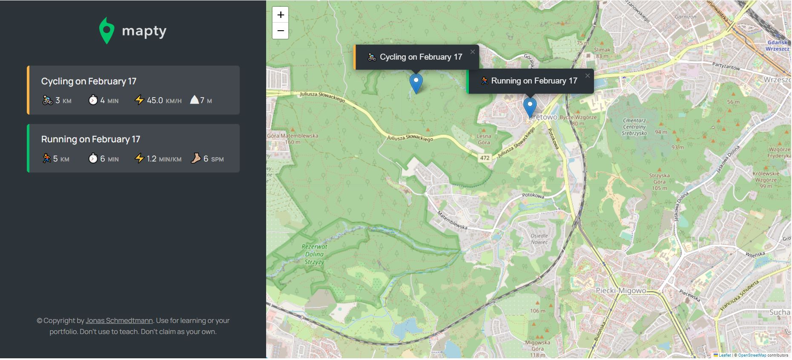
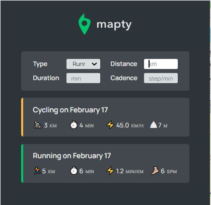

# Mapty Project

Purpose of the application - recording and saving trainings (running, cycling)

This project was built with the author in an online course "The Complete JavaScript Course 2023: From Zero to Expert!" from Udemy.

## Table of contents

- [Overview](#overview)
  - [Screenshot](#screenshot)
  - [Links](#links)
- [My process](#my-process)
  - [Built with](#built-with)
  - [What I learned](#what-i-learned)
  - [Useful resources](#useful-resources)

## Overview

Users should be able to:

- Currently, this version of the application is only for desktop users, I will develop it also to view the optimal layout for each of the website's pages depending on their device's screen size
- See hover states for all interactive elements on the page
- after loading the page, the map will automatically move to the user's current position using geolocation API
- after clicking on a point on the map, a form will appear with the option of adding a new workout at that point
- after clicking on one workout from the list, the position on the map will be changed to the position of this workout
- Everything is stored in Local Storage

### Screenshot





### Links

- Live Site URL: [Live site from GIT](https://irina-dehtiarenko.github.io/mapty-Project_with_OOP/)

## My process

### Built with

- Semantic HTML5 markup
- CSS custom properties
- Flexbox
- CSS Grid
- OOP (Object-oriented Programing)
- Geolocation API
- Local Storage
- [Leaflet Library](https://leafletjs.com/index.html) - Leaflet is library for mobile-friendly interactive maps

### What I learned

I learned about:

- using Geolocation API:

```js
if (navigator.geolocation) {
  navigator.geolocation.getCurrentPosition(
    this._loadMap.bind(this),
    function () {
      alert('Could not get your position');
    }
  );
}
```

- using Forkify JS library and adding it manually as a script to the HTML file:

```js
this.#map = L.map('map').setView(coords, this.#mapZoomLevel);

L.tileLayer('https://tile.openstreetmap.org/{z}/{x}/{y}.png', {
  attribution:
    '&copy; <a href="https://www.openstreetmap.org/copyright">OpenStreetMap</a> contributors',
}).addTo(this.#map);
```

- storing some data in the local storage:

```js
localStorage.setItem('workouts', JSON.stringify(this.#workouts));
```

### Useful resources

- [The Complete JavaScript Course 2023: From Zero to Expert!](https://www.udemy.com/course/the-complete-javascript-course/) - This is the course during which I built this project, I also learned a lot of useful things. The author explains everything very thoroughly, very deeply explaining complicated things.
